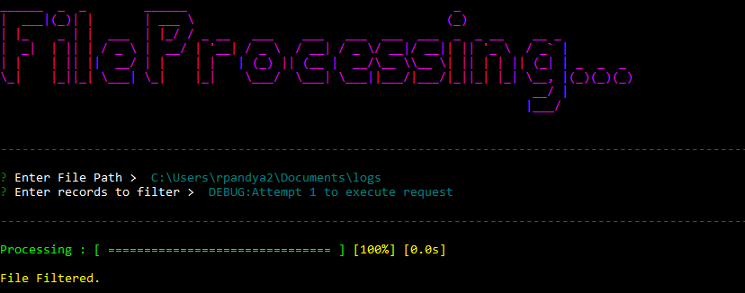

# ProgressBar

ProgressBar is a NodeJS application that filter file records and create a new file which contains only records needed filtered, and this whole it shows progress in ProgressBar.

## Steps to Configure Project - 
> Install NODEJS in system. (Skip this step if nodejs is already installed.
> Move to Project Directory. Command - cd ProgressBar
> Install Yarn. Command - npm install -g yarn. (Skip thi step if yarn is already installed).
> Install all dependencies using yarn. Command - yarn install
> Now, dependencies are installed. So Start running project using. yarn start
> It will start project.
> Give the File Full Path which is tobe filtered with string to be filtered with.
> It will create a new file with filtered records.
